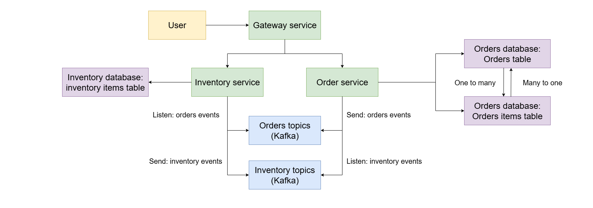

<h1 align="center">inventory-management</h1>

  

## 🌐 Язык

- [English](README.md)
- [Русский](README.ru.md)

## О приложении
Микросервисное приложение на базе Spring Boot и Kafka для управления запасами склада и оформления заказов.

## Технологии
- Spring Boot  
- PostgreSQL  
- Hibernate  
- Apache Kafka  
- Docker  
- JUnit 5 и Mockito  
- Testcontainers  
- GitHub Workflows  

## Функционал
Приложение состоит из двух основных микросервисов: **Inventory** и **Orders**.
- **Сервис склада**:
  - Регистрация и удаление товаров  
  - Увеличение и уменьшение количества на складе  
- **Сервис заказов**:
  - Оформление заказов по доступным товарам  
  - Публикация событий заказов в Kafka  

## Архитектура приложения

  

## Лицензия

Copyright (c) 2025 Zapolyarny

Проект распространяется под лицензией MIT — см. файл [LICENSE](LICENSE) для подробностей.
